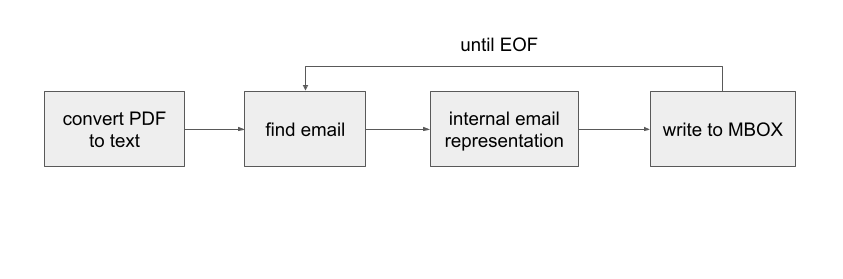

<!-- _class: lead -->
## **Creating Email Archives from PDFs - The COVID-19 Corpus**
EA:BCC Email Archiving Symposium
Ben Lis - History Lab, Columbia University
June 14th, 2023

---
## Creating Email Archives from PDFs -The COVID-19 Corpus Abstract

> This awardee project briefing provides an overview of the efforts to build a Python library that extracts individual email metadata and text from PDFs. We will also report our experiences using it to enhance a corpus of FOIAed documents, some thousands of pages long, regarding the response of public officials, mostly state and local, from the early days of the COVID-19 pandemic.
---
<!-- _class: lead -->

# Thank you to EA:BCC and the Mellon Foundation!

---
# Slides - https://github.com/benjlis/eabcc-presentation

---
# Disclaimer
* I'm **not** an archivist
* I'm **not** a historian
* But I do develop software tools and infrastructure for historians and archivists
---
# Agenda
1. Background
2. Software we built
3. Follow-on work
4. Questions & Discussions 
---
<!-- _class: lead -->

# Background

---

# The History Lab
* History as Data Science
* We turn documents into data and develop tools to explore history
* Home to the FOIArchive 
  * the world's largest database of declassified documents
* Focus on international relations and U.S. Foreign Policy
* New area of research: History of COVID-19 
* http://history-lab.org
---
# History Lab & Emails
* Our PI, Matt Connelly, was on the task force that produced [The Future of Email Archives](https://www.clir.org/pubs/reports/pub175/) report.
* Ben Lis participates in the [EA-PDF Liaison Working Group (LWG)](https://pdfa.org/community/ea-pdf-lwg/)
* [Processed & Analyzed](http://history-lab.org/clinton) Hillary Clinton's email
---
# FOIA 
* Freedom of Information Act
* Federal law requiring full or partial disclosure of U.S. Gov't documents
* Sunshine laws: state & local equivalents
* FOIAed, FOIAing: describes the process of requesting government documents
---
# LBJ on FOIA

> A democracy works best when the people have all the information that the security of the Nation permits. No one should be able to pull curtains of secrecy around decisions which can be revealed without injury to the public interest.

* h/t [Daniel DeFraia](https://daniel-defraia.squarespace.com/) 
---
# Collection Building with FOIAed Docs
* Excellent example: [Documenting COVID-19](https://documentingcovid19.io)
* Created by Derek Kravitz at the Brown Institute for Media Innovation
* Local, state, and federal COVID-19 related documents, including well over 35K emails
* Award-winning: 2022 National Headliners Award, 2021 Sunshine Award, 2020 Free Speech & Open Government Award  
---
# Challenges of FOIAed Document Collections
1. Long-term preservation
2. Document processing &larr; This talk's focus 
---
# Email Formats for Archives
|Emails|NARA|LOC|
|----|---------|----------|
|Aggregated|**PST, MBOX**|PST, MBOX, PDF
|Individual|**EML, MBOX**, MSG, XML|EML, MSG, PDF|

* Preferred formats are bolded
* Sources: [NARA](https://www.archives.gov/records-mgmt/policy/transfer-guidance-tables.html#email2), [LOC](https://www.loc.gov/preservation/resources/rfs/email.html)

---
# FOIAed Email Formats
* Predominant: PDF
* Occasional: PST, MBOX
---
# PDF FOIAed Email Example
* Anthony Fauci's Emails
* NIH FOIA by Jason Leopold
* Available on MuckRock's DocumentCloud
* https://www.documentcloud.org/documents/20793561-leopold-nih-foia-anthony-fauci-emails
---
# PDF Email challenges
* Loss of 
  * access to attachments
  * structure
  * easy access to metadata
  * content, if scanned
* Not apt to be in PDF/A

---
# PDF/email
* A group of archivists and PDF experts are developing a PDF standard that eliminates many of these shortcomings   
* Known originally as EA-PDF, now called PDF/mail
* Long-term goal: PDF/M ISO standard 
* Check out Mike and Chris's [talk](https://emailarchivesgrant.library.illinois.edu/timetable/event/project-briefing-11/) Thursday at 11:00 CDT 
---
<!-- _class: lead -->

# Software we built with the grant

---
## Until we have something like PDF/mail:
It will be preferable for archivists to process email using MBOX, PST, or IMAP because structure and information are lost on export to PDF.

## Our hypothesis: 
If the above options are unavailable, there is often enough information in an email PDF to create a proxy of the original that is good enough for processing.

---
# pdf2mbox


* command-line utility and Python library
* input: PDF containing emails
* process: Parses PDF to recreate email structure (metadata & text)
* output: MBOX or CSV file containing emails
---
# Installation
* open-source, distributed under the MIT License
  * [GitHub repository](https://github.com/history-lab/pdf2mbox)
* requires Python 3.8 or higher
* available on [PyPI](https://pypi.org/project/pdf2mbox/)
* simple install from your Python environment:
```
pip install pdf2mbox
```
---
# Command-line usage
```
python -m pdf2mbox email.pdf out.mbox
```
Supports:
* individual email, single PDF
* aggregated emails, single PDF
* multiple PDFs
---
# Command-line options
```
    python pdf2mbox.py [-h] [--version] [--overwrite] [--csv [CSV]]
                       pdf_file [mbox_file]

    positional arguments:
      pdf_file         PDF file provided as input
      mbox_file        MBOX file generated as output

    optional arguments:
      -h, --help       show this help message and exit
      --version, -v    show program's version number and exit
      --overwrite, -o  overwrite MBOX file if it exists
      --csv [CSV]      generate CSV file output
```
---
# Python usage
```
    from pdf2mbox import pdf2mbox
   
    pe = pdf2mbox(pdf_file, mbox_file) # pe contains dict of emails
```
The email parser we developed for the project, xmpdf, is available standalone:
   * [GitHub repo](https://github.com/history-lab/xmpdf)
   * [PyPI](https://pypi.org/project/xmpdf/)
---
# How it works

* rules-based parser
* single pass 
* only uses text
* email = header + body

---
# Caveats
* Works best with a more standard email header 
```
From:    Yogi Bear
Sent:    Wed, 14 Jun 2023 15:00:00
To:      Boo Boo Bear
Cc:      Ranger
Subject: Have you seen my picnic basket?
```
* Assumes an email ends where a new email begins
* If you encounter errors installing pdf2mbox, please check the OS-level dependencies of both the [pdftotext](https://pypi.org/project/pdftotext/) and [python-magic](https://pypi.org/project/python-magic/) packages to ensure you have the required libraries installed, as pdf2mbox utilizes both these packages.

---
# Using it to build a corpus
1. Run pdf2mbox on the PDF emails to extract email metadata and text
2. Database the metadata and text (in our case, using PostgreSQL with full-text search)
3. Improve the discoverability by applying natural language processing (NLP)
    * NER - named entity recognition
    * Topic modeling 
4. Build a simple GUI (in our case, using Streamlit)

Check it out: [COVID-19 Archive Prototype](https://covid19-prototype.history-lab.org/)

---
<!-- _class: lead -->

# Follow-on Work

---
# We're expanding the COVID-19 Corpus!
* Collaboration between MuckRock & History Lab
* Actively seeking document submissions - [find out more](https://www.muckrock.com/news/archives/2023/may/10/covid-archive-history-lab/)
* Other document types included, not just emails
* Made possible in part by a grant from the [National Historical Publications & Record Commission - NHPRC)](https://www.archives.gov/nhprc)

---
# PII: Personally Identifiable Information
Examples:
* Email address 
* Phone numbers
* SSN 
* Credit Card # 
* Home Address 
* Names of non-public figures
---
# PII Detection & Redaction
* FOIAed documents may contain unredacted PII
* We're using open-source libraries to detect and redact PII:
   * detect: 
      * [CapOne DataProfiler](https://github.com/capitalone/DataProfiler),
      * [CommonRegex Improved (crim)](https://github.com/brootware/commonregex-improved)
   * redact: [PyMuPDF](https://github.com/pymupdf/PyMuPDF)
* Works well especially on the simpler elements
* Not perfect, so we'll continue to look to improve

---

# What I'd like to work on that is not yet scheduled
* Applying generative AI to email parsing and document splitting
* Evaluate [Microsoft Presidio](https://microsoft.github.io/presidio/) for PII detection

---
<!-- _class: lead -->

# Questions & Discussion

---
<!-- _class: lead -->

# Thanks!

